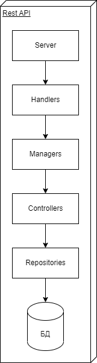

# AvitoInternship
Avito Backend Go Task

Тема: Микросервис для работы с балансом пользователей

## Техническое задание

Необходимо реализовать микросервис для работы с балансом пользователей (зачисление средств, списание средств, перевод средств от пользователя к пользователю, а также метод получения баланса пользователя). Сервис должен предоставлять HTTP API и принимать/отдавать запросы/ответы в формате JSON.

**Требования к сервису:**

:heavy_check_mark: Сервис должен предоставлять HTTP API с форматом JSON как при отправке запроса, так и при получении результата.

:heavy_check_mark: Язык разработки: Golang.

:heavy_check_mark: Фреймворки и библиотеки можно использовать любые.

:heavy_check_mark: Реляционная СУБД: MySQL или PostgreSQL.

:heavy_check_mark: Использование docker и docker-compose для поднятия и развертывания dev-среды.

:heavy_check_mark: Весь код должен быть выложен на Github с Readme файлом с инструкцией по запуску и примерами запросов/ответов (можно просто описать в Readme методы, можно через Postman, можно в Readme curl запросы скопировать, и так далее).

:heavy_check_mark: Разработка интерфейса в браузере НЕ ТРЕБУЕТСЯ. Взаимодействие с API предполагается посредством запросов из кода другого сервиса. Для тестирования можно использовать любой удобный инструмент. Например: в терминале через curl или Postman.

**Будет плюсом:**

:x: Покрытие кода тестами.

:x: Swagger файл для вашего API.

:heavy_check_mark: Реализовать сценарий разрезервирования денег, если услугу применить не удалось.

**Основное задание (минимум):**

:heavy_check_mark: Метод начисления средств на баланс.
*Принимает id пользователя и сколько средств зачислить.* 

:heavy_check_mark: Метод резервирования средств с основного баланса на отдельном счете.
*Принимает id пользователя, ИД услуги, ИД заказа, стоимость.*

:heavy_check_mark: Метод признания выручки – списывает из резерва деньги, добавляет данные в отчет для бухгалтерии. 
*Принимает id пользователя, ИД услуги, ИД заказа, сумму.*

:heavy_check_mark: Метод получения баланса пользователя. 
*Принимает id пользователя.*

**Дополнительные задания:**

:heavy_check_mark: Бухгалтерия раз в месяц просит предоставить сводный отчет по всем пользователем, с указанием сумм выручки по каждой из предоставленной услуги для расчета и уплаты налогов.

*Задача*: реализовать метод для получения месячного отчета. 
*На вход*: год-месяц. 
*На выходе*: ссылка на CSV файл.

:heavy_check_mark: Пользователи жалуются, что не понимают за что были списаны (или зачислены) средства.

*Задача*: необходимо предоставить метод получения списка транзакций с комментариями откуда и зачем были начислены/списаны средства с баланса. Необходимо предусмотреть пагинацию и сортировку по сумме и дате.

**Также были реализованны:**

:heavy_check_mark: Метод перевода средств между пользователями.

:heavy_check_mark: Логи.


## Детали запуска

Для корректной работы приложения предполагается, что **порт сервера 8080** и **порт базы данных 5432** свободны.

Затем из корневой папки репозитория следует выполнить следующую команду.

```bash
sudo make run
```

## Детали реализации приложения

Следует отметить, что при разработке архитектуры данного приложения использовался подход чистой архитектуры для изоляциии компонентов друг от друга, возможности легкой подмены одной реализации компонента другой. Также обособленный домен помогает быстрее искать ошибки и неточности, упрощает написание тестов.

Таким образом решены две наиболее распространенные проблемы:
* Проблема зависимости от реализации
* Проблема расширения и масштабирования

Далее представленно верхнеуровневое разбиение на компоненты.



## Результаты работы программы

|  |  |
|---|---|
| Метод получения баланса пользователя. | GET /api/v1/users |
| Метод перевода между пользователями. | POST /api/v1/transfer |
| Метод начисления средств на баланс. | POST /api/v1/users/add |
| Метод резервирования средств с основного баланса на отдельном счете. | POST /api/v1/services/reserve |
| Метод признания выручки. | POST /api/v1/services/accept |
| Метод возврата денег на счёт пользователю, если услугу не удалось применить. | POST /api/v1/services/cancel |
| Метод получения месячного отчёта. | POST /api/v1/reports/finances |
| Метод получения списка транзакций пользователя. | GET /api/v1/reports/users |

**Метод получения баланса пользователя**
*Запрос*
```text
http://localhost:8080/api/v1/users?userID=12345
```
  
*Ответ*
200 - OK
```json
{
  "balance": 99999,
}
```
400 (неверный параметр в запросе), 401 (пользователь с id = user_id не найден), 500 (ошибка сервера)
```json
{
  "error": "string",
}
```

**Метод перевода между пользователями**

*Тело запроса*
```json
{
  "comments": "cool_transfer",
  "dst_user_id": 0,
  "src_user_id": 0,
  "value": 50000,
}
```

*Ответ*
200 - OK
```json
{
  "comments": "OK",
}
```
400 (неверный параметр в запросе), 401 (пользователя с id = dst_user_id или src_user_id не существует), 422 (недостаточно средств для совершения транзакции или сумма перевода не положительная), 500 (ошибка сервера)
```json
{
  "error": "string",
}
```

**Метод начисления средств на баланс**

*Тело запроса*
```json
{
  "comments": "cool_message",
  "value": 9999,
  "user_id": 12345,
}
```

*Ответ*
200 - OK
```json
{
  "comments": "OK",
}
```
400 (неверный параметр в запросе), 422 (сумма перевода должна быть положительной), 500 (ошибка сервера)
```json
{
  "error": "string",
}
```

**Метод резервирования средств с основного баланса на отдельном счете**

*Тело запроса*
```json
{
  "order_id": 23,
  "comments": "reserve_message",
  "value": 123,
  "service_id": 412,
  "user_id": 654,
}
```

*Ответ*
200 - OK
```json
{
  "comments": "OK",
}
```
400 (неверные параметры в запросе), 401 (пользователя с id = user_id не существует), 422 (недостаточно средств), 500 (ошибка сервера)
```json
{
  "error": "string",
}
```

**Метод признания выручки**

*Тело запроса*
```json
{
  "order_id": 1,
  "service_id": 5,
  "user_id": 2,
}
```

*Ответ*
200 - OK
```json
{
  "comments": "OK",
}
```
400 (неверные параметры в запросе), 401 (пользователя с id = user_id не существует), 403 (у заказа неподходящий статус для подтверждения услуги), 404 (заказ не найден в системе), 500 (ошибка сервера)
```json
{
  "error": "string",
}
```

**Метод возврата денег на счёт пользователю, если услугу не удалось применить**

*Тело запроса*

```json
{
  "comments": "cancel_message",
  "order_id": 2,
  "service_id": 1,
  "user_id": 3,
}
```

*Ответ*
200 - OK
```json
{
  "comments": "OK",
}
```
400 (неверные параметры в запросе), 401 (пользователя с id = user_id не существует), 403 (у заказа неподходящий статус для подтверждения услуги), 404 (заказ не найден в системе), 500 (ошибка сервера)
```json
{
  "error": "string",
}
```

**Метод получения месячного отчёта**

*Запрос*

```text
http://localhost:8080/api/v1/reports/finances?month=3&year=2002
```

*Ответ*
200 - OK
```json
{
  "fileURL": "report.csv",
}
```
400 (неверные параметры в запросе), 500 (ошибка сервера).
```json
{
  "error": "string",
}
```

**Метод получения списка транзакций пользователя** 

*Запрос*

```text
http://localhost:8080/api/v1/reports/users?userID=1&orderBy=id&limit=1&offset=0
```

*Ответ*
200 - OK
```json
{
  "transactions": [
    {
      "action_comments": "action_comment",
      "add_comments": "add_comment",
      "value": 100,
      "created_at": "date",
      "transaction_id": 0,
      "transaction_type": 0,
      "userID": 0,
    }
  ]
}
```
400 (неверные параметры в запросе), 401 (пользователь с id = user_id не найден в системе), 500 (ошибка сервера)
```json
{
  "error": "string"
}
```

